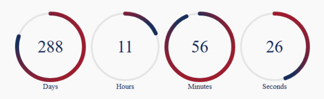

# Simple countdown timer made in vuejs

This is just a working example of countdown timer using vuepress.



Packges used:

- [Vuepress](https://vuepress.vuejs.org/)
- [Vue-countdown](https://github.com/fengyuanchen/vue-countdown)
- [Vue-radial-progress](https://github.com/wyzantinc/vue-radial-progress)

Complete configurations for all the required packages are also present, you need not to worry for that.

# Getting Started

These instructions will get you a copy of the project up and running on your local machine for development.

# Prerequisites

What things you need to install the software and how to install them

```
Git & NPM or Yarn installed on your local machine
```

# Installation

A step by step series of examples that tell you how to get a development env running

```

$ git clone https://github.com/mansern/countdown-timer.git
$ npm install && npm run serve


# Authors

- Muhammad Anser Naseer (muhammadin87@gmail.com)
```
